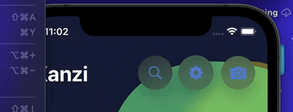
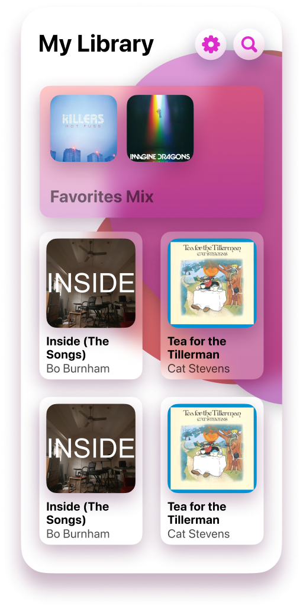

# Blobmorphism

Blobmorphism is a brand new design language I've created to break free of the material overload in iOS, built in SwiftUI. Everything feels smooth and fluid.

It has 2 main components that make it up.

# Preview





# Usage

### Blobs

The two main blobs are `RoundedBlob` and `CircleBlob`

#### Rounded

```swift
RoundedBlob() // or RoundedBlob(cornerRadius: 30)
```

#### Circle

*This one is even more simple. No corner radius to worry about.*

```swift
CircleBlob()
```

### Buttons

There are two different types of buttons: `ButtonBlob` and `SearchBlob`. *(Search is my favorite)*

#### Standard Button

```swift
ButtonBlob(systemImage: "square.and.arrow.up") {
  // What happens when the button is tapped.
} // Choose whatever system image you'd like to use.
```

#### Search Button

The search button switches between a standard button and a search bar. It is important that on compact UIs (iPhone, iPad Split View) that you remove the buttons next to it if it is in an `HStack`.

```swift
@State var isSearching: Bool = false
@State var search: String = ""

SearchBlob(isSearching: $isSearching, search: $search)
```

# Installation

As long as your project is targeting **iOS 14+**, **macOS 11+**, or **tvOS 14+**, you can add this library to your app via SPM.

`https://github.com/EthanLipnik/Blobmorphism.git`

